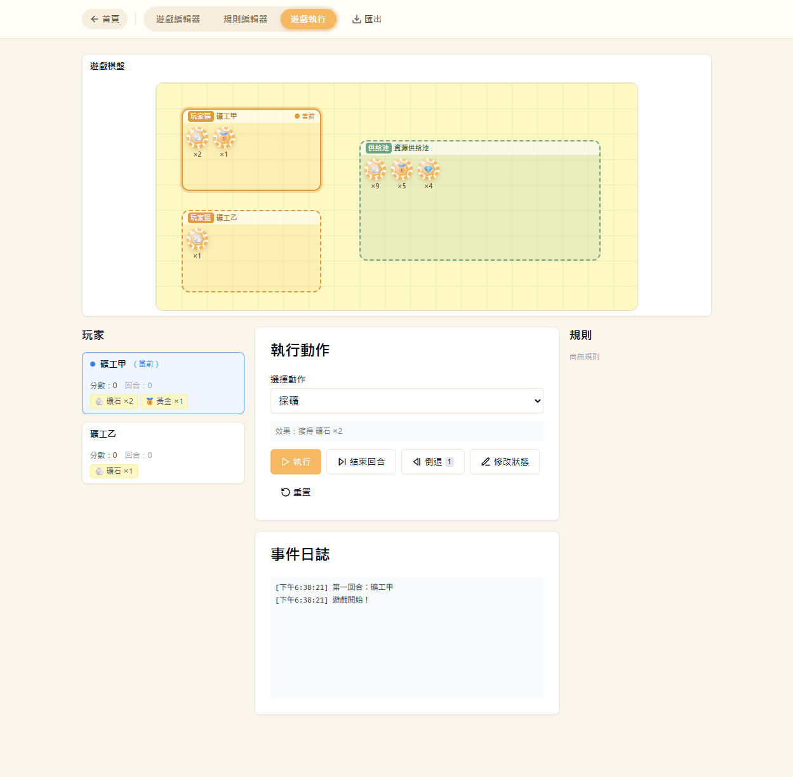
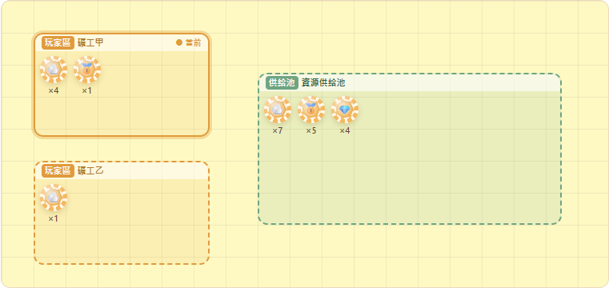
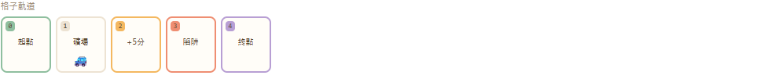

# M5 運行時視覺棋盤 — 驗證證據

> 驗證日期：2026-06-06　方式：Playwright 實機操作 + 像素檢視
> 測試模組：淘金熱（視覺棋盤測試）— 2 玩家、3 資源（含供給上限）、3 zones、5 格軌道

## 測試資料

| token | icon | supply |
|-------|------|--------|
| 礦石 ore | 🪨 | 12 |
| 黃金 gold | 🥇 | 6 |
| 寶石 gem | 💎 | 4 |

初始持有：礦工甲 = 礦石×2、黃金×1；礦工乙 = 礦石×1。
zones：礦工甲玩家區（count）、礦工乙玩家區（stack）、資源供給池（全部有供給的 token）。

## CASE 1：初始渲染 — 玩家區計數 + 供給池殘量

- 礦工甲玩家區（實線邊框 + ● 當前）：礦石 ×2、黃金 ×1 ✅
- 礦工乙玩家區（虛線，stack 疊放）：礦石 ×1 ✅
- 資源供給池：礦石 ×9、黃金 ×5、寶石 ×4 ✅
  - 殘量 = supply − Σ玩家持有：礦石 12−(2+1)=9、黃金 6−1=5、寶石 4−0=4，全部相符。

## CASE 2：互動連動 — 執行「採礦」(礦工甲 +2 礦石)

- 礦工甲礦石：×2 → ×4 ✅
- 供給池礦石：×9 → ×7 ✅（玩家獲得即從池扣除，單一 source of truth 連動，無第二份真相）

## CASE 3：格子軌道 + token 位置標記 — 執行「前進」(探勘車 +2 格)

- 5 格軌道依序渲染：起點(綠)、礦場、+5分(橘)、陷阱(珊瑚)、終點(紫) ✅
- 探勘車 🚙 由場外(-1) 前進 2 格落在 index 1「礦場」，標記正確顯示於該格 ✅
- 格子類型配色對應 CellTemplateType ✅

## 結論

S17–S19 全數通過。視覺棋盤三層（玩家資源區、供給池殘量、格子軌道）皆即時讀取真相層
（player.tokens / pilesState / tokenPositions / getSupplyRemaining），動作執行後即時更新，
未引入任何位置或數量的第二份 source of truth。
