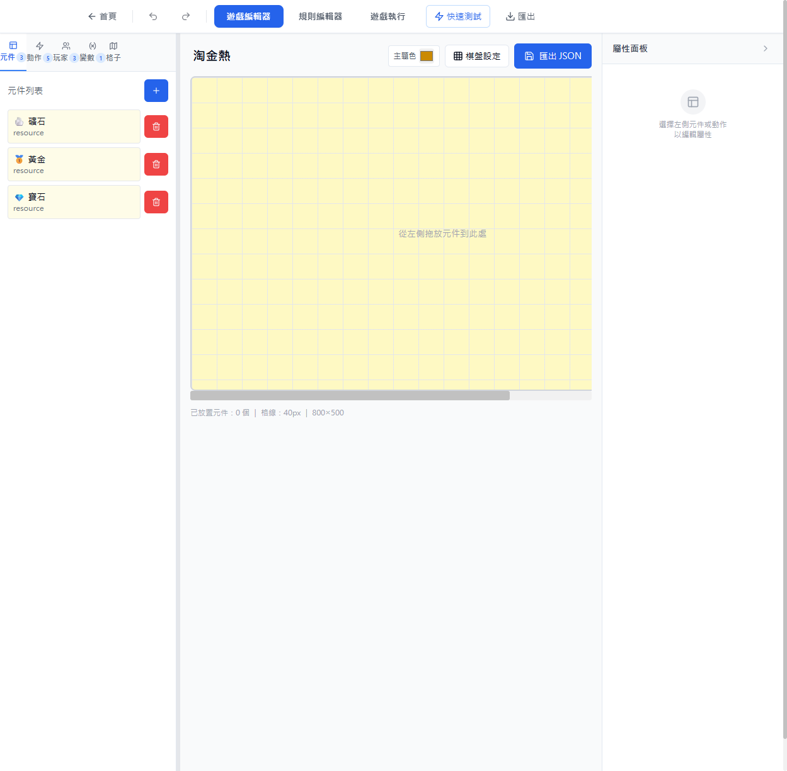
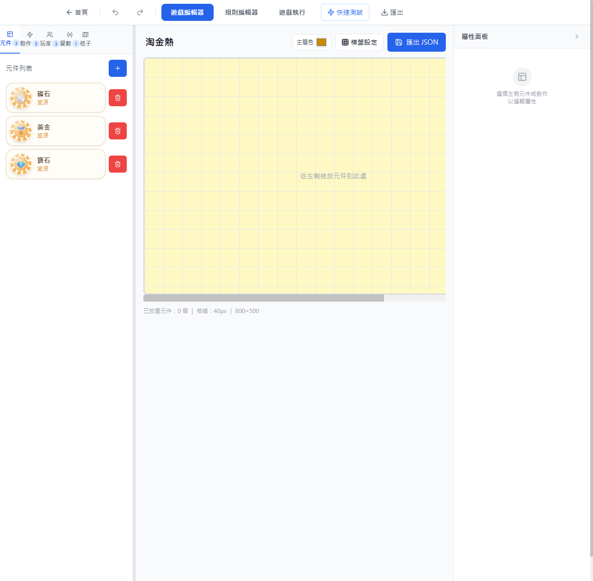
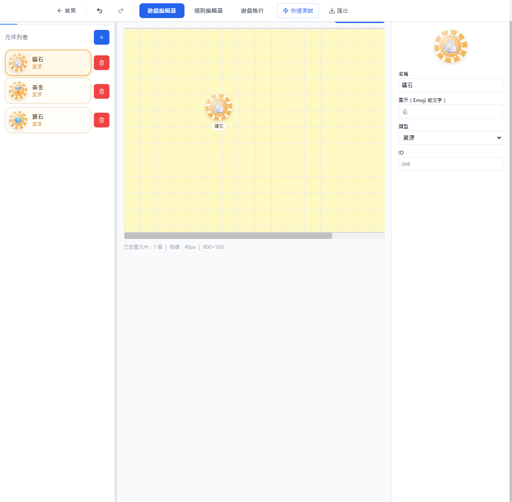
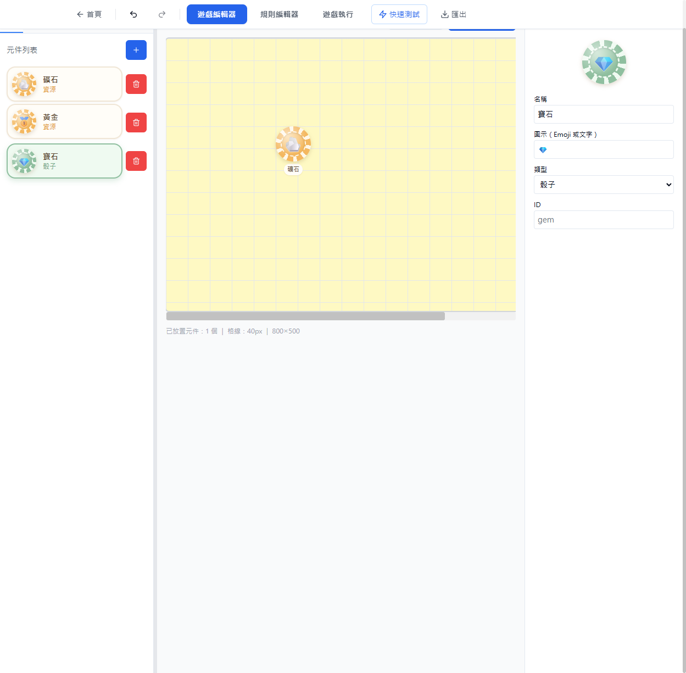

# UI-CHIP：元件改為賭場籌碼造型

> 日期：2026-05-31 ｜ 檔案：[src/components/GameEditor.tsx](../../src/components/GameEditor.tsx)

## 需求
編輯器的 drag and drop 元件太小。改成賭場籌碼造型（有內外圈），中心放 emoji / 元素，配色採家庭、溫馨、輕鬆風格。

## 設計
新增 `TokenChip` 元件，依 token 類型套用暖色蠟筆色盤：

| 類型 | 主色 | 風格 |
|------|------|------|
| resource 資源 | 蜂蜜橘 #F4B860 | 溫暖 |
| card 卡片 | 蜜桃珊瑚 #EF8E72 | 柔和 |
| dice 骰子 | 抹茶綠 #8FBF9F | 清新 |
| custom 自訂 | 薰衣草紫 #B89FD4 | 可愛 |

籌碼結構：
- 外圈：`repeating-conic-gradient` 交錯白色邊點，模擬籌碼鋸齒
- 內圈：徑向漸層面盤 + 白色虛線環
- 中心：token.icon（emoji）或名稱首字，含高光增加硬幣立體感
- 選取態：同色描邊環 + 放大 1.06×

套用位置：左側元件列表（44px）、棋盤放置元件（64px）、右側屬性面板預覽（80px）。

## 驗證（Playwright）
| 證據 | 說明 |
|------|------|
|  | 改造前：小方塊卡片 |
|  | 改造後：左側籌碼列表 |
|  | 拖放到棋盤後顯示 64px 籌碼 + 名稱標籤（已放置元件：1個） |
|  | 切換類型即時換色（骰子→抹茶綠） |

拖放使用原生 HTML5 DnD 事件序列驗證（react-dnd HTML5 backend 不接受 Playwright 合成滑鼠拖放）。
