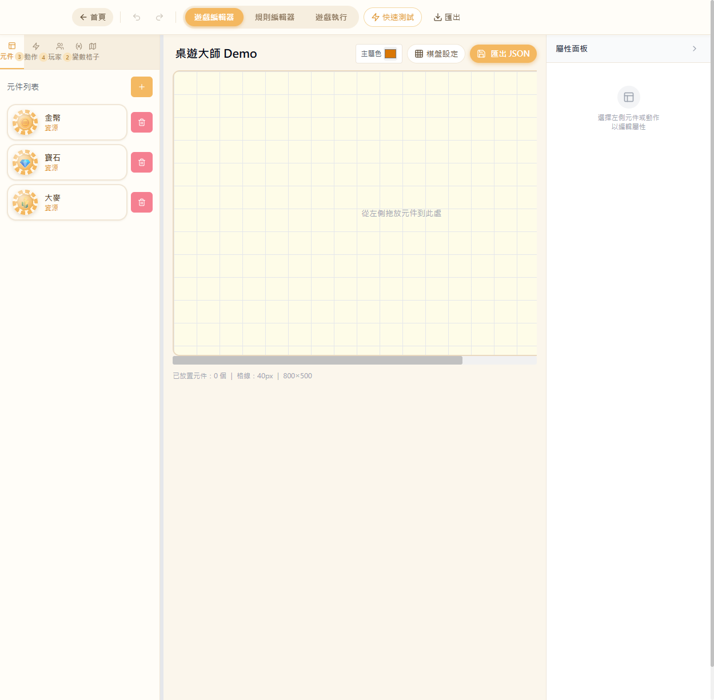

# UI-MENU：頂部導覽列改為簡約暖色風

> 日期：2026-05-31 ｜ 檔案：[src/App.tsx](../../src/App.tsx)、[src/components/GameEditor.tsx](../../src/components/GameEditor.tsx)、[src/index.css](../../src/index.css)

## 需求
上方 menu 改為簡約、符合家庭溫馨輕鬆風格，配色避免冷色藍。並把專案設計風格寫進 `CLAUDE.md`。

## 改動
1. **頂部導覽列（App.tsx）**：奶油白底 + 淺奶茶邊框；tab 改為膠囊群組，active 為蜂蜜橘填底白字；首頁/快速測試/匯出改暖色膠囊鈕，hover 輕微上浮。
2. **編輯器左側 tab（GameEditor.tsx）**：active 由藍改蜂蜜橘底線 + 橘字；計數徽章改暖橘。
3. **頂部工具列**：棋盤設定 / 匯出 JSON 改蜂蜜橘膠囊。
4. **全域按鈕色票（index.css）**：`--primary` 藍→蜂蜜橘 `36 87% 67%`、`--destructive` 大紅→柔玫瑰 `351 85% 73%`、`--accent`/`--border` 改暖奶油。連帶「+」新增鈕與刪除鈕全 app 統一暖色。
5. **棋盤拖放高亮**：isOver 由藍改蜂蜜橘。
6. **CLAUDE.md**：新增「設計風格」章節，定義色票與造型準則。

## 驗證（Playwright）

頂部膠囊 tab（遊戲編輯器 active 橘底）、首頁/快速測試/匯出暖色鈕、左側元件 tab 橘色 active、「+」蜂蜜橘、刪除柔玫瑰、籌碼維持暖色。編譯無 error，console 無報錯。
